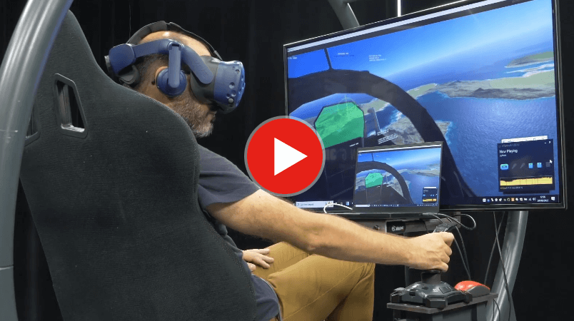
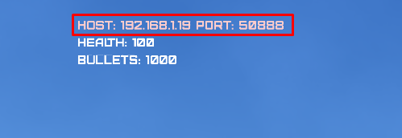
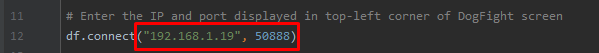
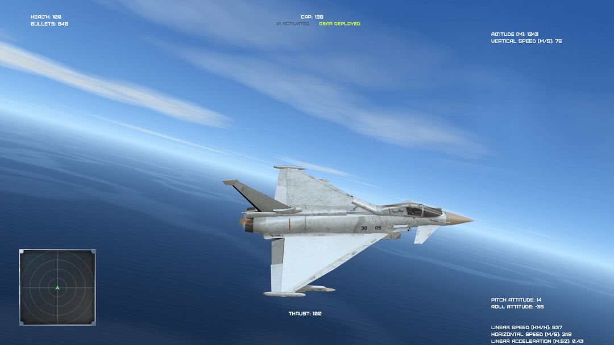
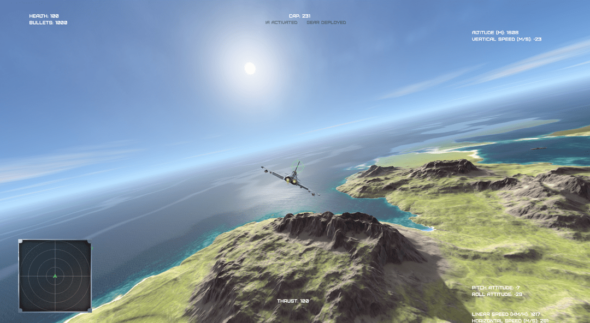
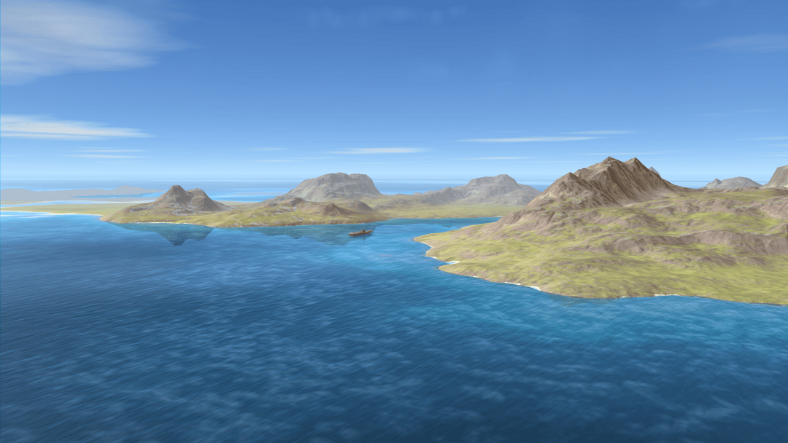
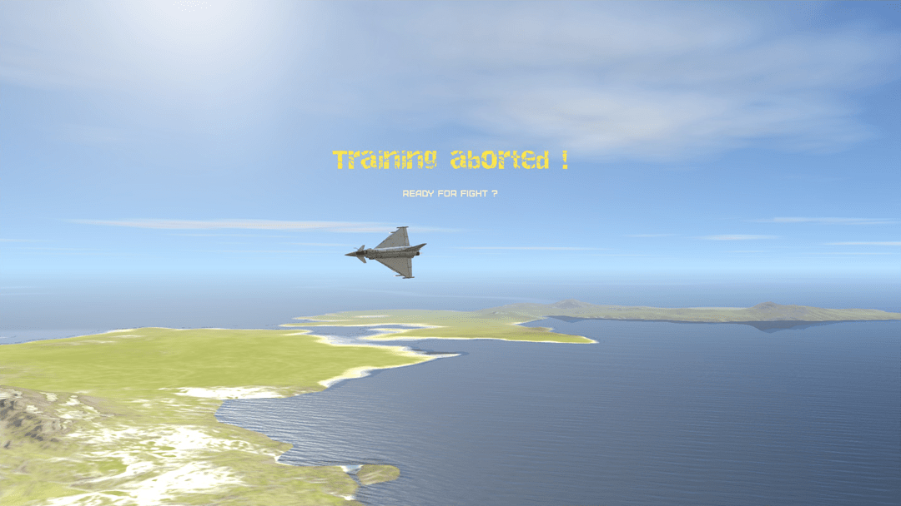
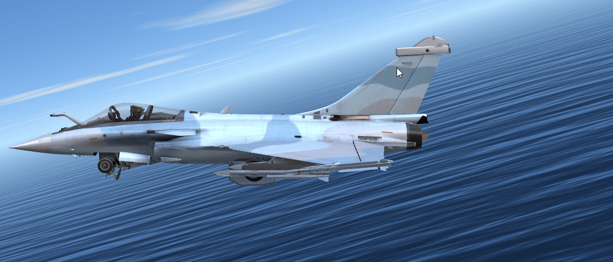
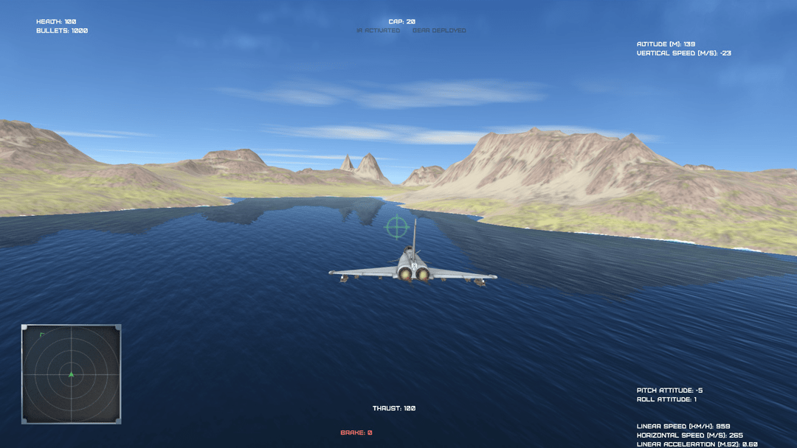

# Dogfight 2 (Air to air combat Sandbox)

Air to air combat sandbox, created in Python 3 using the [HARFANG 3D 2 framework](https://www.harfang3d.com).

**Table of content**

- [Overview](#dogfight-2-air-to-air-combat-sandbox)
- [How to run the Dogfight Sandbox](#how-to-run-the-dogfight-sandbox)
- [About VR mode](#about-vr-mode)
- [Network mode overview](#network-mode-overview)
- [Aircraft Commands](#aircraft-keyboard-commands)
- [Contributors](#contributors)
- [Screenshots](#screenshots)
- [Publications and citations](#publications-and-citations)

[](https://www.youtube.com/watch?v=4Q2f0dKh8vE)

The game features : 
* VR (on any SteamVR compatible headset)
* Ocean / terrain shader
* Skydome shader
* Clouds
* Autopilot (Take-off, landing, fight)
* Network mode

The source code and the graphics assets are made available for studying purpose. However, you are free to fork this repository, extend the game or release anything that is based on it.

## How to run the Dogfight Sandbox
1. Download the [most recent release](https://github.com/harfang3d/dogfight-sandbox-hg2/releases) (dogfight-sandbox-hg2-win64.7z)
1. Unzip it
1. run *start.bat*
1. Select a scenario using the `right` and `left` keys
   * Press `space` if you want to control the aircraft using the keyboard
   * Press the `start` button of the gamepad or the joystick depending on the device you want to use
   * If you press the `start/fire` button on the gamepad, the Sandbox will automatically define this controler as the input device of the aircraft (see **Aircraft keyboard Commands** below for the details of the keyboard inputs) 

(If you want to run the sandbox _from the cloned repository_, you will need to copy the Python and HARFANG binaries as well as the other modules in the [bin folder](https://github.com/harfang3d/dogfight-sandbox-hg2/tree/main/bin)). Follow the instructions detailled in the readme files found in each folder.

## About VR mode
* VR works on Windows machines only, using the DirectX backend (set `"OpenGL": false` in the **config.json** file)
* All the views are available in VR (exterior, interior). When using the cockpit view (`3` on the numpad), press `F11` to calibrate the position of the head
* Requires SteamVR (1.22.x) at least
* Tested on the following headsets with success:
  * LENOVO VR Explorer
  * HTC Vive Pro
  * Meta Quest 2 (in Oculus Link mode)

## Network mode overview

The "Network" mode allows you to control the planes from a third party machine.  
### Startup:
1. On the server machine:  
    * Start the DogFight SandBox (start.bat file)  
    * Choose the **Network mode** mission  
     
    * Note the IP and port number of the server, in the upper left corner of the screen
     

1. On the client machine:  
    * Make sure you have a version of python 3 installed  
    * Copy the content of the directory `network_client_example`.  
    * Open the file `client_sample.py` with a text editor.
    * Enter the server ids in the "df.connect ()" function.  
    
    
    * Start the file `client_sample.py`

## Aircraft keyboard Commands  

| Command | Key |
| ------- | :-: |
| Increase thrust level | Home |
| Decrease thrust level | End |
| Increase brake level | B |
| Decrease brake level | N |
| Increase flaps level | C |
| Decrease flaps level | V |
| Roll left | Left |
| Roll right| Right |
| Pitch up| Up |
| Pitch down| Down |
| Yaw left| Suppr |
| Yaw right| PageDown |
| Switch post combustion| Space |
| Next target | T |
| Switch gear | G |
| Activate IA | I |
| Activate Autopilot | A |
| Switch easy steering mode | E |
| Fire machine gun | Enter |
| Fire missile | F1 |
| Increase health level | P |
| Decrease health level | M |
| Rearm | F5 |
| HUD on /off | H |

## Commons Views commands

| Command | Key |
| ------- | :-: |
| Roll cameras carousel (aircrafts, FPS) | 1 |
| Increase FoV angle | PageUp |
| Decrease FoV angle | Insert |

## Aircrafts views commands

| Command | Key |
| ------- | :-: |
| Back view | 2 |
| Front view | 2 |
| Left view | 4 |
| Right view | 6 |
| Satellite view | 5 |
| Tactical view | 7 |
| Pursuit view | 9 |
| Cockpit view | 3 |

## FPS camera views commands

| Command | Key |
| ------- | :-: |
| Head orientation | LMB + mouse move |
| Move forward | Up, Z |
| Move backward | Down, S |
| Move left | left, Q |
| Move right | right, D |
| Fast speed 1 | Left Shift + move |
| Fast speed 2 | Left Ctrl + move |
| Fast speed 3 | Right Ctrl + move |

## Supported control devices

* Keyboard
* XBox gamepad or any compatible model
* Logitech "Attack 3" Joystick

## Contributors
* Code, design, music / sfx:
  * Eric Kernin
* 3D graphics: 
  * Jean-Marie Lamarche
  * Bruno Lequitte
* Technology & design advisory: 
  * Muhammet Aksoy
  * Pr. Emre Koyuncu
  * Michel Nault
  * Muhammed Murat Özbek
  * Thomas Simonnet

## Screenshots













## Publications and citations

### Harfang3D Dog-Fight Sandbox: A Reinforcement Learning Research Platform for the Customized Control Tasks of Fighter Aircrafts

(Muhammed Murat Özbek, Süleyman Yıldırım, Muhammet Aksoy, Eric Kernin, Emre Koyuncu)

[Harfang3D Dog-Fight Sandbox: A Reinforcement Learning Research Platform on arxiv.org](https://arxiv.org/abs/2210.07282)

_How to cite this publication:_
 
```
@misc{2210.07282,
  Author = {Muhammed Murat Özbek,  Süleyman Yıldırım,  Muhammet Aksoy, Eric Kernin and Emre Koyuncu},
  Title = {Harfang3D Dog-Fight Sandbox: A Reinforcement Learning Research Platform for the Customized Control Tasks of Fighter Aircrafts},
  publisher = {arXiv},
  doi = {10.48550/ARXIV.2210.07282},
  Year = {2022},
  Eprint = {arXiv:2210.07282},
}
```
