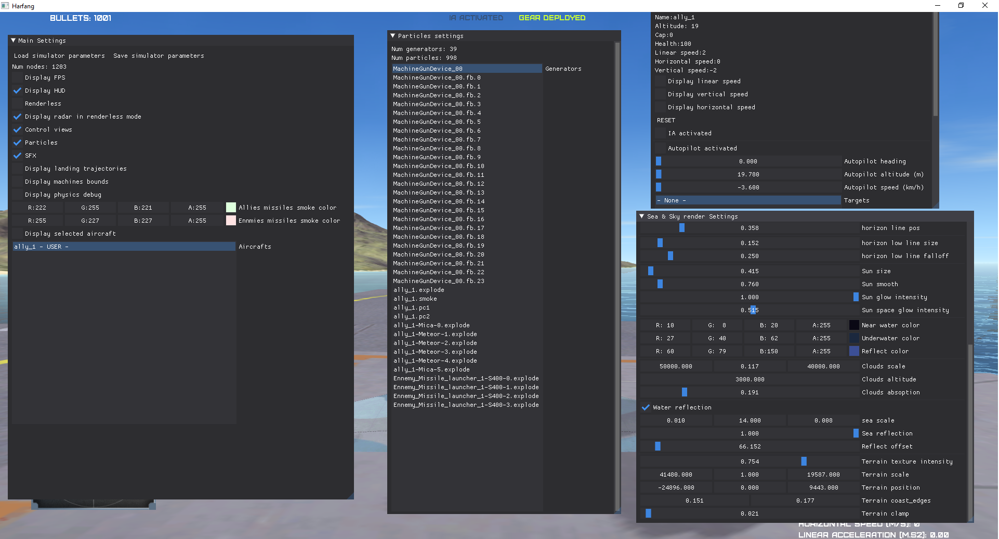

# Dogfight Sandbox - Debug documentation

## Debugger

The "Debugger" mode allows you to see and control all settings related to your game instance.

### Control

| Open debugger | F12 |

### Debugger View

