# HARFANG3D - Dogfight sandbox 2  
## Tutorial - Ajout d'une texture dans la scène

### 1.Importer la texture  

Importer votre texture texture dans le dossier `source/assets/textures/`  

### 2.Installation Harfang Studio:  

Vous pouvez télécharger Harfang studio ici : https://www.harfang3d.com/en_US/pricing  

  

### 3.Ouvrir le projet:

Après la procédure d'installation, démarrer Harfang Studio, puis cliquer sur "Open Project":  

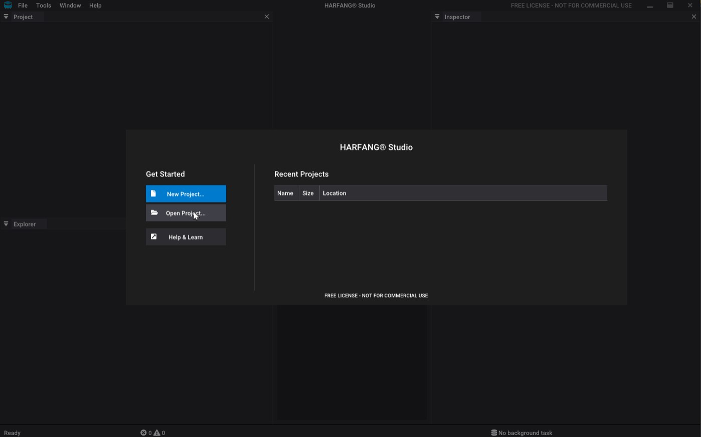  

Depuis le browser qui s'ouvre, aller dans le dossier du Dogfight puis ouvrir le fichier `source/assets/project.prj`  

  

### 4.Dupliquer la scène plane.scn  

Depuis le panneau `Project`, ouvrir la scène `primitives/plane.scn`  

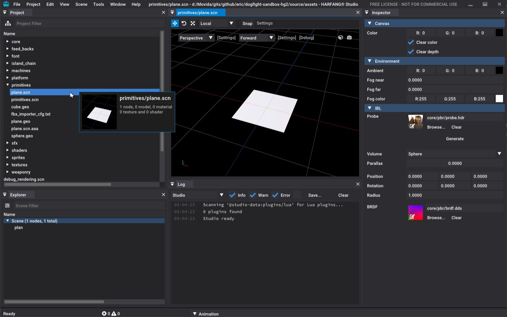  

Sauvegarder la scène sous un autre nom (ex: `my_plane.scn`)  

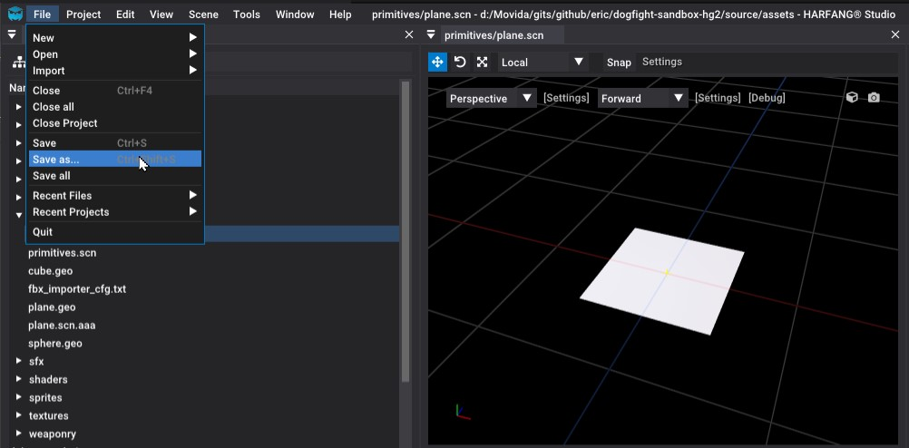  
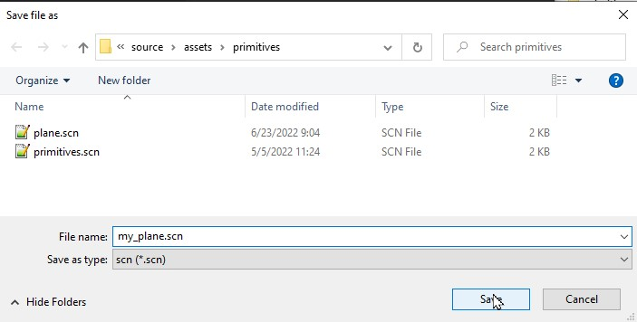

### 5.Charger la texture dans le materiau  

Sélectionner le plan dans le panneau de la vue 3D:  

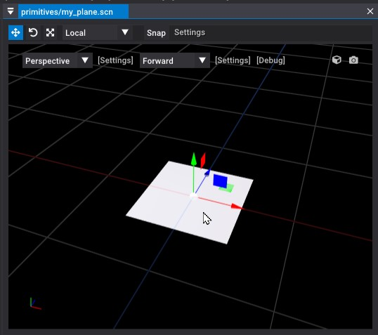  

Dans le panneau Inspector, déployer le materiau:  

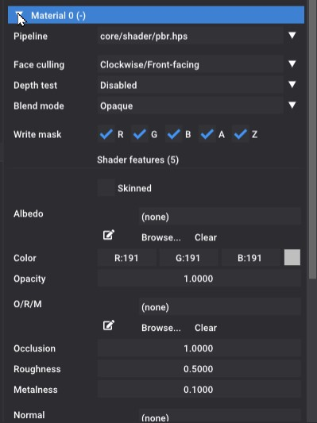  

Cliquer sur le browser pour sélectionenr la texture d'Albedo:  

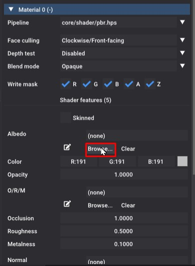  

Sélectionner la texture:  

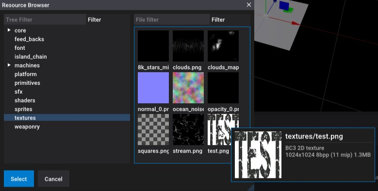  

La texture a été assignée au plan:  

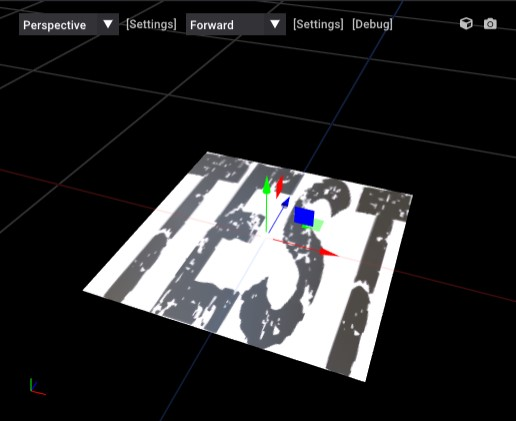  

Sauvegarder la scène `my_plane.scn`

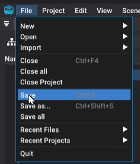  

### 6.Importer le plan dans la scène principale  

Depuis l'explorateur de projet, ouvrir `main.scn`:  

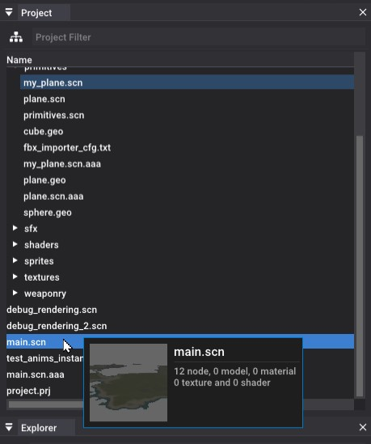  

Dans le menu `Scene/Add`, importer une instance:  

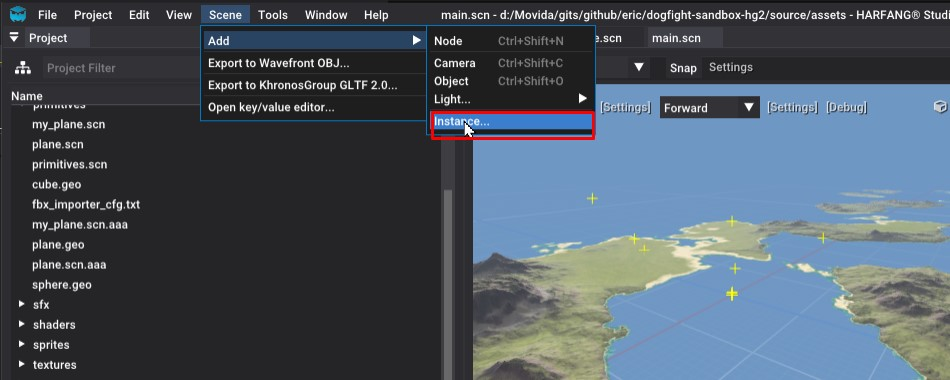  

Importer votre plan:  

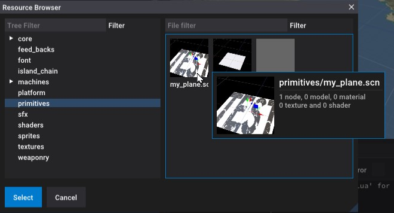  

Appuyer sur Left-Shift + A pour focaliser sur le plan:  

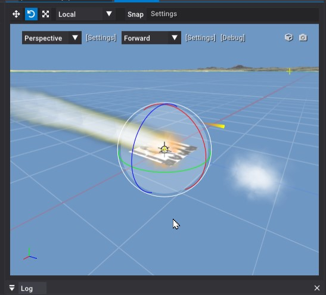  

Utiliser les différents types de gizmos pour déplacer / orienter / mettre à l'échelle votre plan dans la scène:

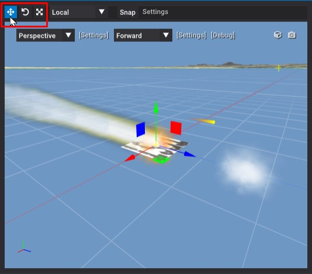  

Une fois placé votre plan, sauvegarder:  

  

### 7.Démarrer le Dogfight !

Démarrer le Dogfight en cliquant sur le batch:
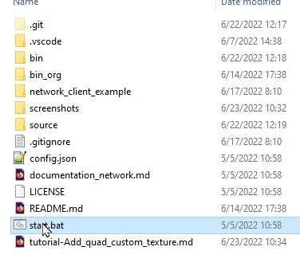  

Votre texture est bien dans la scène !

  